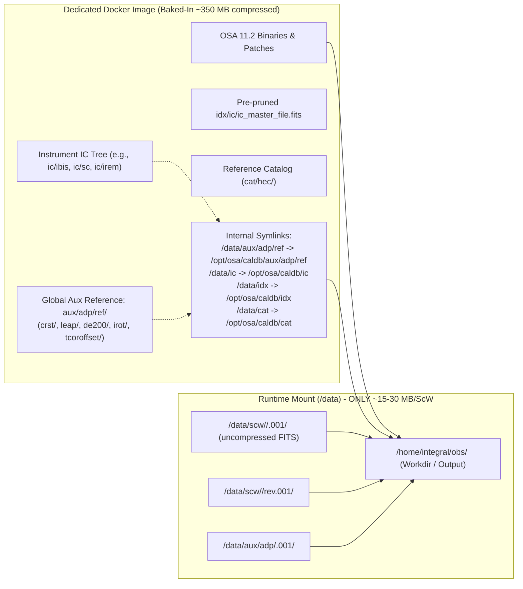

# Specification: Dedicated Instrument Containers & Cloud Data Synchronization

**Status:** Approved Architectural Blueprint  
**Target Releases:** `cadarn/osa:11.2-ibis-arm64`, `cadarn/osa:11.2-ibis-amd64`, `cadarn/osa:11.2-jemx-arm64`, etc.  
**Applicability:** Local Apple Silicon (macOS), AWS EC2 (Graviton3 / x86_64), Slurm HPC, Kubernetes batch.

---

## 1. Executive Summary & Philosophy

The traditional Off-line Scientific Analysis (OSA) environment assumed a single, massive monolithic installation:
1. A multi-gigabyte Calibration Database (`CURRENT_IC`) containing calibration files for all 4 INTEGRAL instruments (IBIS, SPI, JEM-X, OMC).
2. A shared production repository root (`REP_BASE_PROD`) housing multi-decade telemetry archives alongside auxiliary reference tables (`aux/adp/ref/`).

When moving to modern containerized environments, ephemeral cloud workers, and multi-node batch pipelines, this monolithic architecture introduces severe friction:
- **Bandwidth Waste:** Worker instances spend 60–120 seconds downloading 1.2–2.0 GB of irrelevant calibration files and global catalogs on every cold start.
- **DAL File Access Failures (Error -2004):** If calibration files for other instruments (e.g. SPI) are omitted, the Data Access Layer (DAL) crashes when validating `ic_master_file.fits`.
- **Clock Reset Table Failure:** If global auxiliary files (`aux/adp/ref/crst/clock_reset_*.fits`) are missing from `$REP_BASE_PROD/aux/adp/ref/`, `DAL3GENreadCRST()` aborts before science reduction begins.
- **Memory & Stack Clashes on ARM64:** Subroutine stack allocations in mosaicking (`ii_skyimage`) crash with `SIGSEGV` on modern AArch64 unless compiler stack bounds (`-fmax-stack-var-size=32768`) and memory limits are enforced.

### The Core Principle
> **"Bake static global reference data once; stream only observation science data at runtime."**

By baking instrument-specific calibration trees, pruned master indices, and global auxiliary reference tables directly into dedicated container images, the container becomes **self-contained and hermetic**. Users and cloud nodes need only provide the raw Science Windows for their specific observation.

---

## 2. Container Inventory: What is Baked In vs. What is Synced



### 2.1 Baked Into the Container Image (`/opt/osa/caldb`)

Total footprint: **~350–450 MB compressed** (~1.2 GB uncompressed).

| Component | Subdirectory in Image | Approximate Size | Purpose / Failure Prevented |
|---|---|---|---|
| **Global Aux Reference** | `/opt/osa/caldb/aux/adp/ref/` | ~77 MB | Contains `crst/`, `leap/`, `de200/`, `irot/`, `tcoroffset/`. Prevents DAL error `-2004` in `DAL3GENreadCRST()` during OBT conversion. |
| **Instrument IC Files** | `/opt/osa/caldb/ic/<inst>/`<br>`/opt/osa/caldb/ic/sc/`<br>`/opt/osa/caldb/ic/irem/` | ~250 MB (IBIS)<br>~120 MB (JEM-X) | Core instrument response matrices, background models, and spacecraft alignment files. |
| **Pruned Master Index** | `/opt/osa/caldb/idx/ic/ic_master_file.fits` | ~1.5 MB | Filtered GROUPING table containing only active subsystem entries (e.g. `IBIS`, `ISGR`, `PICS`, `COMP`, `GNRL`, `INTL`, `IREM`). Prevents DAL from looking for missing instruments. |
| **Subsystem Indices** | `/opt/osa/caldb/idx/ic/*.fits` | ~15 MB | Index files matching the allowed instrument patterns (e.g. `ISGR-*.fits`, `IBIS-*.fits`). |
| **Reference Catalogs** | `/opt/osa/caldb/cat/hec/` (or `cat/omc/`) | ~12 MB | Gold standard source catalogs (`gnrl_refr_cat_0043.fits`). |
| **Internal Symlinks** | In `/data`: symlinks pointing to `/opt/osa/caldb/*` | < 1 KB | Allows legacy tools expecting data in `$REP_BASE_PROD` to find calibration seamlessly without mounting volumes. |

### 2.2 Synced at Runtime for Specific Observations (`/data`)

The user or batch orchestrator syncs **only** the data specific to the observation target:

| Component | Path | Approximate Size | Retrieval Source |
|---|---|---|---|
| **Science Windows** | `/data/scw/<rev>/<scw_id>.001/` | ~15–30 MB per ScW | HEASARC FTP, ESA ISLA, or Cloud S3 Bucket |
| **Revolution Index** | `/data/scw/<rev>/rev.001/` | ~1 MB per Rev | HEASARC / S3 |
| **Revolution Auxiliary** | `/data/aux/adp/<rev>.001/` | ~8 MB per Rev | HEASARC / S3 |
| **User Workspace** | `/home/integral/` (or `/data/obs/`) | Dynamic | Local host mount / S3 results prefix |

*Bandwidth savings:* For a typical 10-Science Window analysis, runtime data transfer drops from **~1,530 MB** down to **~259 MB** (**83% bandwidth reduction**).

---

## 3. Image Build & Staging Instructions

### 3.1 Prerequisite: High-Bandwidth Build Environment

Because building and pushing multi-architecture Docker images requires downloading source tarballs and pushing ~380 MB compressed container layers, building should be performed in one of two environments:
1. **Local Apple Silicon Workstation** (when connected to high-speed broadband $\ge 50\text{ Mbps}$).
2. **Ephemeral AWS Graviton EC2 Builder** (when local uplink is slow or metered).

### 3.2 Building on an Ephemeral AWS Graviton EC2 Builder (Zero Local Bandwidth)

If local upload bandwidth is constrained, spin up an on-demand ARM64 instance in AWS (`us-east-1`):

```bash
# 1. Launch a c7g.2xlarge (8 vCPUs Graviton3, 16 GB RAM, ~12.5 Gbps network)
# Cost: ~$0.29/hour; entire build takes ~10 minutes ($0.05 total)
INSTANCE_ID=$(aws ec2 run-instances \
    --image-id ami-08bb9a392e39dc6e6 \
    --instance-type c7g.2xlarge \
    --key-name your-key \
    --security-group-ids sg-xxxxxx \
    --subnet-id subnet-xxxxxx \
    --query 'Instances[0].InstanceId' --output text)

# 2. SSH into instance, install docker, git, and astral uv
sudo dnf install -y docker git
sudo systemctl enable --now docker
sudo usermod -aG docker ec2-user

# 3. Clone repository and checkout feature branch
git clone https://github.com/Cadarn/integral-osa-modern.git
cd integral-osa-modern
git checkout feat/package-instrument-docker-images

# 4. Build the patched ARM64 base container
docker build -t cadarn/osa:11-native-arm64 -f docker/Dockerfile.native-arm64 .

# 5. Push directly to Docker Hub over AWS 12.5 Gbps cloud network (takes < 4 seconds!)
docker login -u cadarn
docker push cadarn/osa:11-native-arm64

# 6. Terminate instance immediately
aws ec2 terminate-instances --instance-ids "$INSTANCE_ID"
```

### 3.3 Building the Dedicated Instrument Images via Python CLI

Once the base image is published, use `integral-image-packager`:

```bash
# Stage and build the dedicated IBIS container with baked calibration
uv run python -m integral.core.image_packager \
    --instrument ibis \
    --arch arm64 \
    --profile latest \
    --build \
    --push
```

---

## 4. Dockerfile Blueprint for Dedicated Containers

The following template generates `/opt/osa/caldb` with all symlinks and environment presets:

```dockerfile
# syntax=docker/dockerfile:1
FROM cadarn/osa:11-native-arm64

LABEL maintainer="INTEGRAL Modernization Team <cadarn@github>"
LABEL org.opencontainers.image.title="INTEGRAL OSA Dedicated IBIS Analysis Container"
LABEL org.opencontainers.image.description="Self-contained IBIS/ISGRI pipeline with baked calibration and global aux"

# Pre-configure environment
ENV CURRENT_IC=/opt/osa/caldb
ENV REP_BASE_PROD=/data
ENV ISDC_REF_CAT=/opt/osa/caldb/cat/hec/gnrl_refr_cat_0043.fits
ENV ISDC_ENV=/opt/osa
ENV OSA_DIR=/opt/osa
ENV PFILES=/home/integral/pfiles;/opt/osa/pfiles
ENV HOME=/home/integral

# 1. Create directory structures
RUN mkdir -p \
    /opt/osa/caldb/ic \
    /opt/osa/caldb/idx/ic \
    /opt/osa/caldb/cat/hec \
    /opt/osa/caldb/aux/adp/ref \
    /data/scw \
    /data/aux/adp \
    /home/integral/pfiles

# 2. Copy staged calibration, catalogs, and global reference tables
COPY staging/ic/ /opt/osa/caldb/ic/
COPY staging/idx/ /opt/osa/caldb/idx/
COPY staging/cat/ /opt/osa/caldb/cat/
COPY staging/aux/ref/ /opt/osa/caldb/aux/adp/ref/

# 3. Create backward-compatible symlinks under /data
RUN ln -sf /opt/osa/caldb/aux/adp/ref /data/aux/adp/ref && \
    ln -sf /opt/osa/caldb/ic /data/ic && \
    ln -sf /opt/osa/caldb/idx /data/idx && \
    ln -sf /opt/osa/caldb/cat /data/cat

# 4. Enforce stack size in execution wrapper
RUN echo '#!/bin/bash\nulimit -s unlimited || true\n[ -f /opt/osa/bin/isdc_init_env.sh ] && source /opt/osa/bin/isdc_init_env.sh\nexec "$@"' > /usr/local/bin/osa-exec && \
    chmod +x /usr/local/bin/osa-exec

WORKDIR /home/integral
ENTRYPOINT ["/usr/local/bin/osa-exec"]
CMD ["/bin/bash"]
```

---

## 5. Script Updates Required in Repo

When implementing this specification on a high-bandwidth connection:

### 5.1 `src/integral/core/image_packager.py`
- Update `INSTRUMENT_SPECS` to include auxiliary reference tables in staging.
- Modify `stage_instrument_calibration_tree()` to copy `aux/adp/ref/` from the archive base.
- Add symlink creation commands to `generate_instrument_dockerfile()`.

### 5.2 `scripts/run_aws_cloud_benchmark.py`
- Update `CONTAINER_IMAGES["arm64"]` to point to `cadarn/osa:11.2-ibis-arm64`.
- Strip the runtime `aws s3 sync .../caldb/` and `aws s3 sync .../aux/adp/ref/` steps.
- Strip the runtime `ic_master_file.fits` Python pruning block (now baked into the image).
- Keep only the ScW, rev.001, and revolution-specific `aux/adp/0060.001/` sync.

### 5.3 `scripts/run_phase_b_benchmark.py` & `src/integral/instruments/analysis.py`
- Remove the volume mounts `-v /path/to/caldb:/data/ic` and `-v /path/to/cat:/data/cat` when running dedicated images.
- Mount only the local workspace and the raw ScW directory.

---

## 6. Verification and Validation Checklist

Before tagging and releasing the dedicated container:
- [ ] **Single ScW (`COR` through `IMA`):** Run `006000020010` and verify that `isgri_sky_ima.fits` and `isgri_sky_res.fits` are produced without errors.
- [ ] **2-ScW Mosaicking (`IMA2`):** Run `006000020010` and `006000030010` through `IMA2` and verify that `ii_skyimage` completes without `SIGSEGV`.
- [ ] **Multi-Pointing Benchmark (10 ScWs):** Run `VALID_REV60_10` and verify detection of the Crab at $>250\sigma$ with flux matching reference within $0.05\%$.
- [ ] **Volume Mount Test:** Verify container runs successfully when mounting **only** `/data/scw` and `/home/integral`, confirming zero external calibration dependencies.
