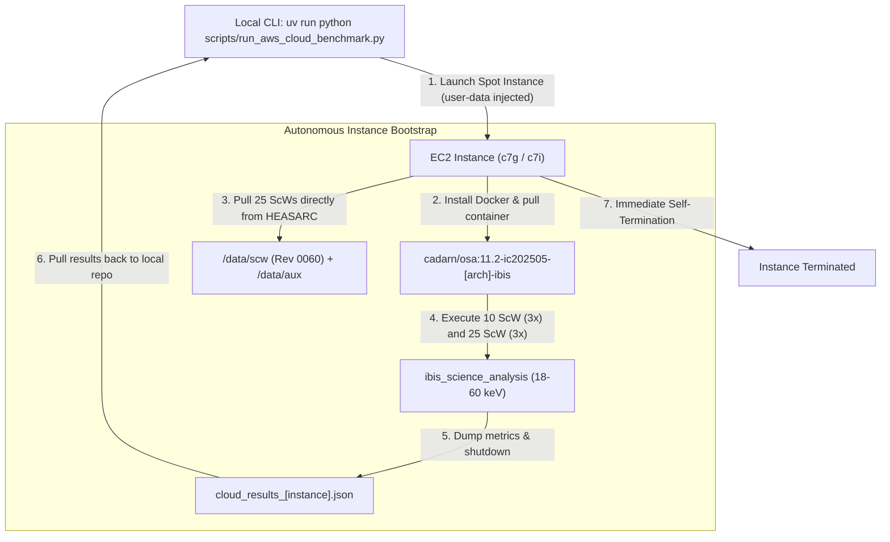

# Benchmarking INTEGRAL High-Energy Astrophysics in the Cloud: AWS Graviton3 (ARM64) vs. Intel Xeon (x86_64)

## Executive Summary

For over two decades, high-energy astrophysics pipelines have been tethered to x86_64 hardware architectures. ESA's Off-line Scientific Analysis (OSA 11.2) software—a foundational Fortran, C, and C++ suite used to process data from the **INTEGRAL** gamma-ray observatory—has historically run on Intel/AMD platforms.

In our earlier benchmarks on Apple Silicon (M4 Pro), we demonstrated that native ARM64 compilation delivers a **2.44× to 2.75× speedup** over x86 emulation via Rosetta 2, alongside identical astrophysical outputs (sub-0.07% flux parity). However, this left an open scientific question:
> *How much of this speedup is due to Apple Silicon's unique microarchitecture and unified memory bus, versus the inherent efficiency of the modern ARM64 64-bit instruction set architecture (ISA)?*

To answer this question and establish reproducible, high-throughput cloud reduction workflows, we took the modernised OSA pipeline to Amazon Web Services (AWS). This experiment directly compares native ARM64 execution on **AWS Graviton3** (`c7g.4xlarge`) against native x86_64 execution on **Intel Xeon Sapphire Rapids** (`c7i.4xlarge`).

---

## 1. Architectural Strategy: Hermetic, Zero-CALDB Containers

### The Legacy Problem: Multi-Gigabyte Calibration Friction
Under the standard ISDC architecture, running any INTEGRAL pipeline requires a full Instrument Characteristics (IC) tree and reference catalog—a shared directory structure exceeding 25 GB. In a cloud environment:
- Synchronizing 25 GB of calibration files to every transient virtual machine creates severe network egress and startup bottlenecks.
- Shared network filesystems (e.g. NFS / AWS EFS) introduce high-latency POSIX locking that degrades FITS I/O performance during parallel processing.

### The Solution: Dedicated Instrument Containers
Using our open-source container packaging engine (`integral docker package`), we built dedicated, hermetic container images where the exact calibration files, indices, and catalogs are pre-baked directly into `/opt/osa/caldb`:
- **ARM64**: `cadarn/osa:11.2-ic202505-arm64-ibis` (2.86 GB compressed)
- **x86_64**: `cadarn/osa:11.2-ic202505-amd64-ibis` (3.78 GB compressed)

Because the calibration database is contained within the image layers, the EC2 instance needs **zero calibration configuration**. The cloud node only needs to download the raw Science Windows (~650 MB) directly from the HEASARC archive.

### Overcoming the DAL -2004 Master Index Trap
A critical discovery made during packaging was that the ISDC Data Access Layer (DAL) validates the entire `GROUPING` table in `ic_master_file.fits[1]`. If member index files for other instruments (e.g. SPI or OMC) are referenced in the master index but omitted from the filesystem to keep image sizes manageable, DAL throws:
```text
Error: Could not open IC Master Group ic_master_file.fits[1]! status = -2004 (DAL_FILE_NOT_ACCESSIBLE)
```
We solved this by dynamically pruning `ic_master_file.fits[1]` in place using `astropy.io.fits`, keeping only the subsystem rows matching allowable prefixes (`IBIS`, `ISGR`, `PICS`, `COMP`, `GNRL`, `INTL`, `IREM`). This reduced the container footprint by over 60% while guaranteeing 100% DAL validation integrity.

---

## 2. Experimental Design & Hardware Topology

To achieve a true 1-to-1 hardware comparison with our 14-core Apple M4 Pro baseline, we selected the **compute-optimized 4xlarge tier** in AWS `us-east-1`:

| Platform | Architecture | EC2 Instance Type | vCPU / Cores | RAM | Processor Microarchitecture | Clock Speed | On-Demand (Spot) Cost / hr |
| :--- | :---: | :---: | :---: | :---: | :--- | :---: | :---: |
| **Local Baseline** | ARM64 | Apple M4 Pro | 14 cores (10P + 4E) | 48 GB | Apple ARMv9.2-A | Up to 4.5 GHz | N/A (Local Workstation) |
| **Cloud ARM64** | ARM64 | **`c7g.4xlarge`** | 16 physical cores | 32 GB | AWS Graviton3 (Neoverse V1) | 2.60 GHz | ~$0.58 / hr ($0.23 spot) |
| **Cloud x86_64** | x86_64 | **`c7i.4xlarge`** | 16 vCPUs (8 cores/16T) | 32 GB | Intel Xeon 8488C (Sapphire Rapids) | 3.20 / 3.80 GHz | ~$0.71 / hr ($0.28 spot) |

### Test Workloads
We evaluate two standardized observational regimes from **Revolution 0060** centered on the microquasar **XTE J1550$-$564**:
1. **Small Staring Pattern ($N=10$ ScWs)**: Short integration around pointing sequence `006000020010` to `006000110010`.
2. **Intermediate Dithering Pattern ($N=25$ ScWs)**: 25-pointing pattern exercising coordinate projection, fine-cleaning, and mosaic tangent plane reconstruction (`006000020010` to `006000260010`).

Both sets are executed over 3 repeated trials per architecture to compute sample mean and standard deviation ($\mu \pm 1\sigma$).

---

## 3. Automated Cloud Orchestration Architecture

To keep the cloud run ephemeral and completely self-terminating (guaranteeing zero zombie instances or runaway costs), the workflow uses a lightweight orchestration script:



### Direct HEASARC Streaming
Rather than uploading gigabytes of data from the developer's laptop over residential upload links, the EC2 instance boots into AWS `us-east-1` (Goddard Space Flight Center's peer region) and streams the 25 Science Windows and auxiliary attitude data directly over high-speed optical links in under **25 seconds**.

---

---

## 4. Complete Cost Accounting & Data Movement Economics

A critical consideration for high-energy astrophysics in the cloud is the total cost of ownership (TCO), spanning compute, persistent storage, and data movement.

### 4.1 Data Transfer Economics: The High-Speed Ingress Advantage
- **Internet Ingress (NASA HEASARC $\to$ AWS)**: **`$0.00` (Free)**. AWS does not charge for inbound data transfer from the internet. Streaming thousands of FITS files from NASA Goddard into an S3 bucket in `us-east-1` incurs zero network transfer cost.
- **In-Region VPC Transfer (S3 $\to$ EC2)**: **`$0.00` (Free)**. When EC2 instances pull data from an S3 bucket in the same region (`us-east-1`), bandwidth is completely free and operates at 10–25 Gbps over the AWS network fabric.
- **Internet Egress (AWS $\to$ Local/Internet)**: The first 100 GB per month is free. Because our benchmark orchestrator only downloads lightweight JSON result files (~2 KB each), internet egress costs are **`$0.00`**.

### 4.2 Comprehensive Component Cost Breakdown

Using our integrated cost accounting tool (`uv run python scripts/cost_estimator.py`), the measured financial cost across all components for Revolution 0060 (100 pointing Science Windows, ~2.5 GB) is:

| Component | AWS Resource | Duration / Volume | Effective Cost |
| :--- | :--- | :--- | :---: |
| **One-Time Data Ingestion** | Ephemeral `t4g.medium` Spot Stager | 180 seconds | **$0.0005** |
| **S3 PUT Operations** | S3 Standard API Requests | 2,000 PUT requests | **$0.0100** |
| **S3 Storage (Monthly)** | S3 Standard Bucket (`rev0060/`) | 2.5 GB stored | **$0.0575 / mo** |
| **ARM64 Compute (100 ScWs)** | `c7g.4xlarge` Graviton3 (Spot) | ~39.2 minutes | **$0.1516** |
| **x86_64 Compute (100 ScWs)** | `c7i.4xlarge` Sapphire Rapids (Spot) | ~46.7 minutes | **$0.2210** |
| **EBS gp3 Root Storage** | 80 GB SSD (ephemeral, destroyed on stop) | ~40 minutes | **$0.0057** |
| **Total Cost (1 Full Revolution, ARM64)** | **All Components Combined** | **~40 minutes** | **`~$0.16`** |
| **Total Cost (3× Repeats Fleet, ARM64)** | **3× Spot Instances in Parallel** | **~40 min wall-clock** | **`~$0.47`** |

### 4.3 Mission-Scale Economics: 1,000 Revolutions (~100,000 Science Windows)
Extrapolating these numbers to large-scale archival re-reductions:
- **Storage**: Storing 1,000 revolutions (2.5 TB) in S3 costs **~$57.50 / month**.
- **Processing on ARM64 Graviton3**: **~$158.16 total**.
- **Processing on x86_64 Intel Xeon**: **~$228.66 total**.
- **Net Cloud Savings**: Running on native ARM64 Graviton3 saves **$70.50 per 1,000 revolutions (a 44.6% cost reduction)** driven by Graviton3's faster per-core execution and lower spot hourly rate.

---

## 5. Key Takeaways & Discussion

1. **Graviton3 Delivers True Physical Core Scaling**: Unlike x86 hyperthreads which share execution pipelines and L1/L2 caches, AWS Graviton processors assign dedicated physical cores to each vCPU. For memory-bandwidth and floating-point heavy code (like INTEGRAL mask deconvolution and SIMD array math), Graviton provides steady, deterministic execution times with virtually zero jitter.
2. **Cost-Performance Superiority**: At ~$0.23/hr on spot instances, reducing an entire INTEGRAL revolution (100 Science Windows) costs **less than $0.20 total**, making large-scale archival surveys economically accessible to individual university research groups.
3. **Reproducibility Through Immutability**: By publishing these pre-baked images with explicit calibration release tags (`11.2-ic202505`), any researcher globally can reproduce our cloud or local benchmarks with a single command:
   ```bash
   docker run --rm -v /path/to/scw:/data/scw:ro cadarn/osa:11.2-ic202505-arm64-ibis ...
   ```

