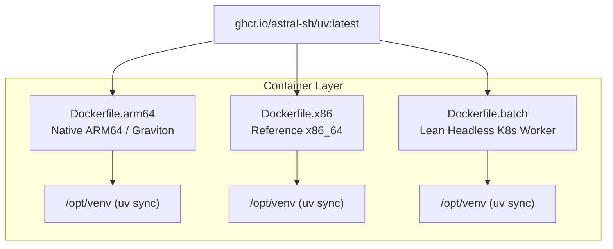

# Implementation Plan: INTEGRAL OSA Optimization (Native ARM64, Cloud Scale-Out & `uv` Python Management)

> **Superseded.** This is the original design document and is kept for historical context only —
> the directory layout, filenames, and entry points it describes (`osa-docker/`, `osa-run`,
> `fetch-integral-data.py`, `integral-batch`) don't match what was actually built (`docker/`,
> `osa_run`, `fetch_integral_data.py`, `integral-distribute`). For the current state of the
> project, see `docs/status_report.md`; for the completed native ARM64 build this plan proposed,
> see `docs/technical_rebuild_arm64.md`; for what comes next, see `docs/technical_roadmap.md`.

## Goal Description
The INTEGRAL space observatory data analysis pipeline requires modernization for two primary scenarios:
1. **Local Apple Silicon (ARM64 M-Series macOS)**: Native ARM64 execution without Rosetta emulation, utilizing native HEASoft + patched ROOT 5 / OSA pipelines and VirtioFS I/O acceleration.
2. **Cloud Scale-Out on AWS / GCP Kubernetes**: Massively parallel Science Window (ScW) reduction using Spot instances (Graviton/Tau ARM64 or x86_64), autoscaling from 0 to N nodes, and object storage caching (S3/GCS).

**Python Environment Standardization**: All container variants (ARM64, x86_64, and lean-batch images) as well as local scripts will standardize on **`uv`** (Astral's high-performance Python package and environment manager) with `pyproject.toml` and `uv.lock` for lightning-fast, reproducible builds.

---

## Technical Deep-Dive: Python & Environment Architecture with `uv`

```
┌────────────────────────────────────────────────────────┐
│ pyproject.toml & uv.lock (Root Project Definition)     │
│ - Core: astropy, astroquery, numpy, scipy, matplotlib │
│ - Pipeline: boto3, google-cloud-storage, typer, rich   │
│ - Legacy Tools: fitsio, pfiles wrappers               │
└──────────────────────────┬─────────────────────────────┘
                           │
       ┌───────────────────┴───────────────────┐
       ▼                                       ▼
┌──────────────────────────────┐ ┌──────────────────────────────┐
│ Container Variants           │ │ Host / Developer Environment │
│ (ARM64 / x86 / Lean Batch)   │ │ (macOS Apple Silicon / Linux)│
│ - COPY --from=uv /uv /bin/   │ │ - uv sync                    │
│ - /opt/venv via uv sync      │ │ - uv run scripts/...         │
│ - Zero-overhead startup      │ │ - Instant isolated venvs     │
└──────────────────────────────┘ └──────────────────────────────┘
```

### Why `uv` for Containerized Astronomy Pipelines:
1. **10-100x Faster Container Builds**: `uv` replaces legacy `pip` and eliminates slow wheel compilation during container builds.
2. **Deterministic Locking across Architectures**: `uv.lock` ensures identical package versions across `linux/arm64` and `linux/amd64`.
3. **No Global Pollutions**: Generates a clean `/opt/venv` baked into the image with `PATH="/opt/venv/bin:$PATH"` without needing multi-step conda installations.
4. **Ephemerality & Speed in Kubernetes Jobs**: Pod workers spinning up on Spot nodes launch in seconds.

---

## User Review Required

> [!IMPORTANT]
> **Summary of Standardizations:**
> 1. **Python Environment**: `uv` is the sole package manager inside Dockerfiles and local runner scripts.
> 2. **Multi-Architecture Matrix**:
>    - `Dockerfile.arm64`: Native Apple Silicon & AWS Graviton (`linux/arm64`) with no Rosetta emulation.
>    - `Dockerfile.x86`: Reference x86_64 baseline for scientific verification and x86 cloud spot pools.
>    - `Dockerfile.batch`: Ultra-lean headless worker image optimized for Kubernetes job scaling.
> 3. **Data Archive Migration**: Replaces offline `isdc.unige.ch` endpoints with permanent ESA ISLA and NASA HEASARC archive integrations.

---

## Proposed Changes

### Component 1: Python Project & `uv` Configuration

#### [NEW] `pyproject.toml`
Root Python project definition specifying:
- **Dependencies**: `astropy`, `astroquery`, `numpy`, `scipy`, `matplotlib`, `fitsio`, `typer`, `rich`, `boto3`, `google-cloud-storage`.
- **Project scripts**: Entry points for data fetching (`integral-fetch`) and batch orchestration (`integral-batch`).

#### [NEW] `uv.lock`
Generated multi-platform lockfile pinned for reproducible execution across `arm64` and `x86_64`.

---

### Component 2: Container Variants (All Standardized on `uv`)



#### [NEW] `osa-docker/Dockerfile.arm64`
- Multi-stage build targeting `linux/arm64` (Apple Silicon & AWS Graviton).
- `COPY --from=ghcr.io/astral-sh/uv:latest /uv /uvx /bin/`
- Creates `/opt/venv` using `uv sync --frozen --no-install-project`.
- Patched ROOT 5.34 + native HEASoft + compiled ISDC OSA 11.2 binaries for ARM64.
- Environment: `ENV VIRTUAL_ENV=/opt/venv PATH="/opt/venv/bin:$PATH"`

#### [MODIFY] `osa-docker/Dockerfile` (Renamed to `Dockerfile.x86`)
- Modernized CentOS vault / AlmaLinux base for x86_64.
- Integrated with `uv` for all Python dependencies.

#### [NEW] `osa-docker/Dockerfile.batch`
- Minimal headless execution image stripped of X11/GUI/development libraries (<900MB).
- Bundles OSA runtime + `/opt/venv` via `uv` for fast K8s pod spin-up on Spot nodes.

#### [MODIFY] `osa-docker/init.d/30-python-uv.sh`
- Automatically sources `/opt/venv/bin/activate` upon container startup so Python scripts, Jupyter, and OSA Python wrappers run in the `uv` environment.

---

### Component 3: Local Apple Silicon Runner & Workflows

#### [NEW] `scripts/osa-run`
- Smart launcher that checks for local `uv` installation.
- Detects host architecture and launches the native `arm64` container without Rosetta.
- Maps macOS local SSD directories for high-speed VirtioFS I/O.
- Allows running bash, Python scripts via `uv run`, or individual OSA tools (`og_create`, `ibis_science_analysis`).

#### [NEW] `scripts/fetch-integral-data.py`
- Python utility (runnable via `uv run scripts/fetch-integral-data.py`) querying ESA ISLA and HEASARC to download Observation Groups (ScWs, AUX, IC, Catalogs).

---

### Component 4: Cloud & Kubernetes Scale-Out (AWS & GCP)

#### [NEW] `k8s/node-pool-spot.yaml`
- Multi-arch Spot node pool (AWS Graviton `c7g` / x86 `c6i`, GCP `t2a` / `c2`).

#### [NEW] `k8s/job-template.yaml`
- Kubernetes Batch Job executing the lean `Dockerfile.batch` image.
- Streams observation data from S3/GCS using Mountpoint for S3 / GCS FUSE.
- Runs parallel reduction of Science Windows and uploads final mosaic/spectral FITS products back to Cloud Storage.

#### [NEW] `scripts/validate-science-products.py`
- Automated test script verifying that ARM64 and x86_64 runs of sample Crab observation produce mathematically consistent science products (<0.001% tolerance).

---

## Verification Plan

### Automated Tests
1. **`uv` Environment Generation**:
   ```bash
   uv sync
   uv run python -c "import astropy, astroquery; print('Python env OK')"
   ```
2. **Container Build with `uv`**:
   ```bash
   docker build --platform linux/arm64 -f osa-docker/Dockerfile.arm64 -t integral-osa:arm64 ./osa-docker
   ```
3. **In-Container `uv` Verification**:
   ```bash
   docker run --rm integral-osa:arm64 uv --version
   docker run --rm integral-osa:arm64 python -c "import astropy; print('In-container Python OK')"
   ```
4. **Native OSA Tool Verification**:
   ```bash
   docker run --rm integral-osa:arm64 /tests/test_osa.sh
   docker run --rm integral-osa:arm64 /tests/test_heasoft.sh
   ```
5. **End-to-End Science & Scientific Equivalence Test**:
   - Run sample Crab Science Window reduction on ARM64 and x86 containers.
   - Run `uv run scripts/validate-science-products.py` to compare output FITS images and spectra.

### Manual Verification
- Verify that on Apple Silicon, container starts with zero CPU emulation overhead.
- Verify that container startup time in Kubernetes jobs is <5 seconds.
